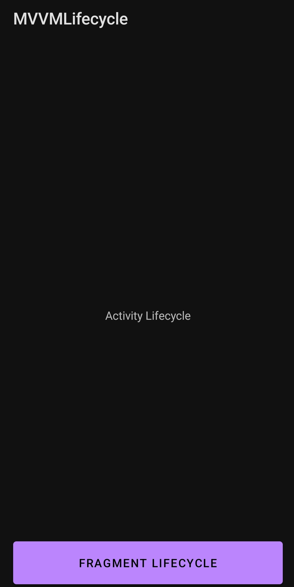
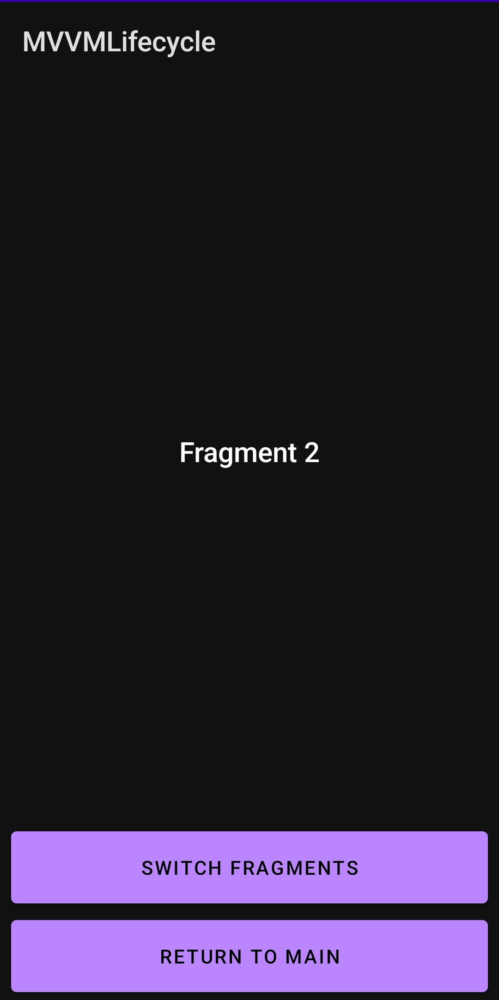
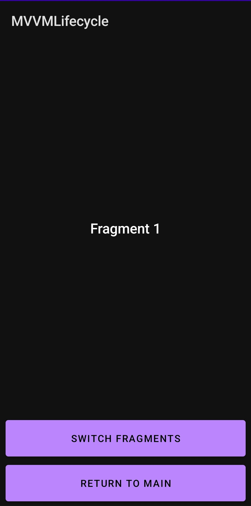

# Приложение, выполняющее логирование при вызове событий жизненного цикла Activity и Fragment

- На главном экране приложения отображается Activity, в которой производится логирование
  при вызове каждого из событий жизненного цикла Activity.  
- При нажатии на кнопку Fragment Lifecycle осуществляется переход в FragmentLifecycleActivity, на котором отображается
  FragmentContainerView.  
  При помощи кнопки "switch fragments" осуществляется переключение между фрагментами 1 и 2.
  При вызове каждого из событий жизненного цикла Fragment осуществляется логирование.

## Скриншоты работы приложения

